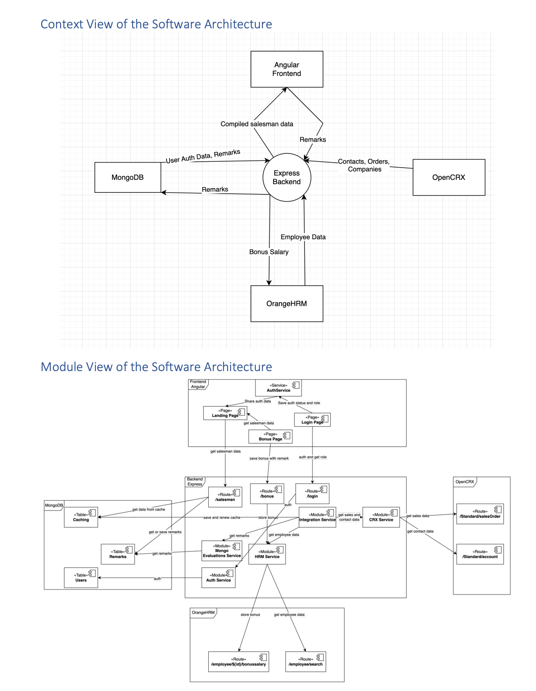

This is a project I've made for the course "Integration Architectures" in 2022 which uses Mongo, Angular, Express and Node stack to integrate REST API's of two different services and some custom business logic on top of it.

